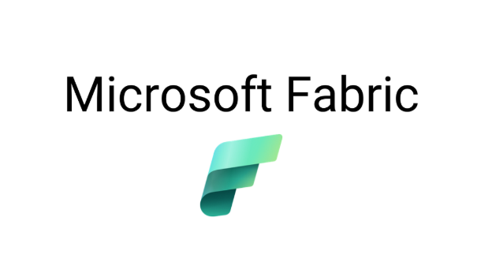
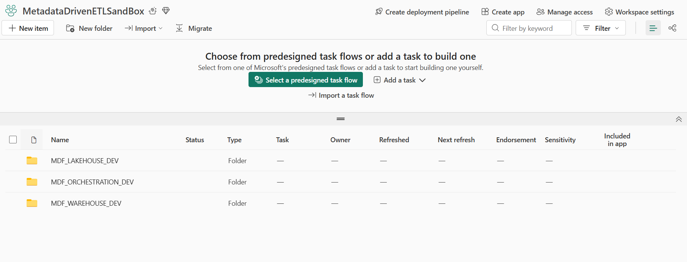
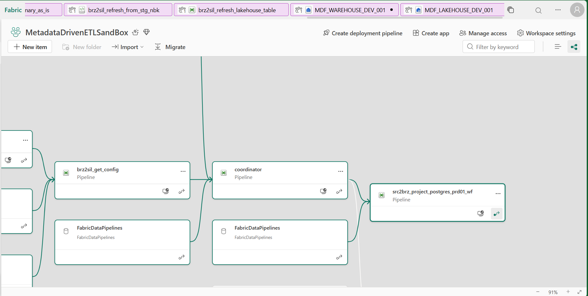

<div align="center">
  
  <h1>Metadata-Driven ETL Framework on Microsoft Fabric</h1>
  <p>A configuration-driven data ingestion and transformation framework built on Microsoft Fabric.<br/>
  Automates the movement of enterprise data from heterogeneous source systems (ERP, SharePoint) into a governed Lakehouse in Bronze and Silver layers — with zero pipeline code changes required to onboard new tables.</p>
</div>

---

## Fabric Workspace

<div align="center">
  
  <p><em>Workspace organized into three top-level folders: Lakehouse, Orchestration, and Warehouse</em></p>
</div>

---

## Architecture Overview

<div align="center">
  
  <p><em>Fabric lineage view showing component dependencies across Pipelines, Lakehouse, Warehouse, Notebook, and SharePoint</em></p>
</div>

```
Sources                  Bronze Layer             Silver Layer
─────────────────────    ────────────────────     ──────────────────
MySQL (ERP)          ─►  Parquet files        ─►  Delta Lake files
SharePoint Lists     ─►  partitioned by date       (V-Order optimized)
SharePoint Files     ─►  (raw, unmodified)         (analytics-ready)
```

**Bronze** — raw data landed as Parquet (snappy-compressed), partitioned by ingest date. No transformation applied. Serves as the immutable source of truth and replay buffer.

**Silver** — data promoted from Bronze, written as Delta Lake with V-Order optimization. Type-corrected and ready for Power BI / DirectLake consumption.

### Pipeline Hierarchy

All pipelines follow a strict 5-tier invocation chain:

```
Workflow Pipeline (per domain, externally triggered)
  └─► Coordinator      (routes by layer: src2brz / brz2sil)
        └─► GetConfig  (reads metadata, determines sequence order)
              └─► ProcessObject  (dispatches tables in parallel per sequence group)
                    └─► Execution Pipeline  (Copy Activity or Spark Notebook)
```

---

## Key Problems This Framework Solves

- **Zero-code table onboarding** — add a new table by inserting 2 rows into configuration tables (`elt_table_config` + `elt_schema_config`). No pipeline modification required.
- **Multi-source support** — the same pipeline chain handles MySQL (ERP), SharePoint Online Lists (structured data), and SharePoint File Libraries (binary files), routed dynamically via metadata.
- **Automatic resume after failure** — every run carries an `original_run_id`. Re-triggering with the same ID skips already-completed tables and processes only what failed, with no risk of data duplication.
- **Parallel execution with conflict-safe stored procedures** — tables within the same sequence group run in parallel; all warehouse writes implement snapshot isolation retry (error 24556) to prevent conflicts.
- **Self-healing error lifecycle** — failures are captured in `error_log` (active). On the next successful run for the same table, errors are automatically archived to `error_log_history` and deactivated — no manual cleanup needed.
- **Dynamic date partitioning** — Bronze folders are partitioned using `utcNow()` computed at runtime, never read from the database, preventing stale-date overwrites.
- **Full data lineage tracking** — every Bronze record is stamped with 6 pipeline lineage columns; the `load_process` catalog table enables a cross-table system status view joining process definitions, load history, and active errors.

---

## Tech Stack

| Component | Technology |
|---|---|
| Orchestration | Microsoft Fabric Data Pipelines |
| Storage | Fabric Lakehouse (OneLake) |
| Metadata & Control Plane | Fabric Data Warehouse |
| Transformation | Apache Spark (PySpark) via Fabric Notebooks |
| Source — ERP | MySQL (ERPNext / Frappe) |
| Source — Structured files | SharePoint Online Lists |
| Source — Binary files | SharePoint Online File Libraries |
| Bronze format | Apache Parquet (Snappy compression) |
| Silver format | Delta Lake (V-Order + Optimize Write) |

---

## Repository Structure

```
Metadata_Driven_ETL_Framework_On_Fabric/
├── assets/                     Screenshots and diagrams for documentation
├── MDF_LAKEHOUSE_DEV/          Lakehouse file samples (Bronze Parquet output)
├── MDF_ORCHESTRATION_DEV/      Fabric pipeline JSON definitions
│   ├── FUNCTION_PIPELINES/     Reusable, parameterized function pipelines
│   └── DATASUBJECT_PIPELINES/  Domain-specific workflow entry-point pipelines
└── MDF_WAREHOUSE_DEV/          Data Warehouse artifacts
    ├── STORE_PROCEDURES/       T-SQL stored procedures (metadata + observability)
    └── TABLE_CONFIGS/          CSV exports of metadata and control plane tables
```

---

For detailed implementation documentation, architecture decisions, SQL, and pipeline logic, see `PRIVATE_README.md` (not distributed in this repository).
